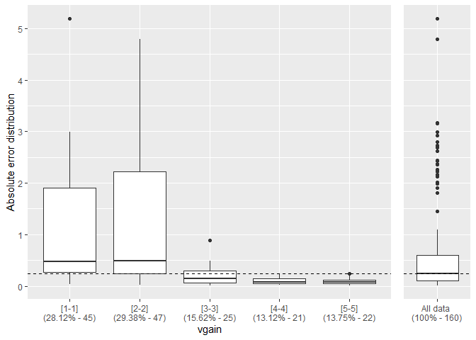
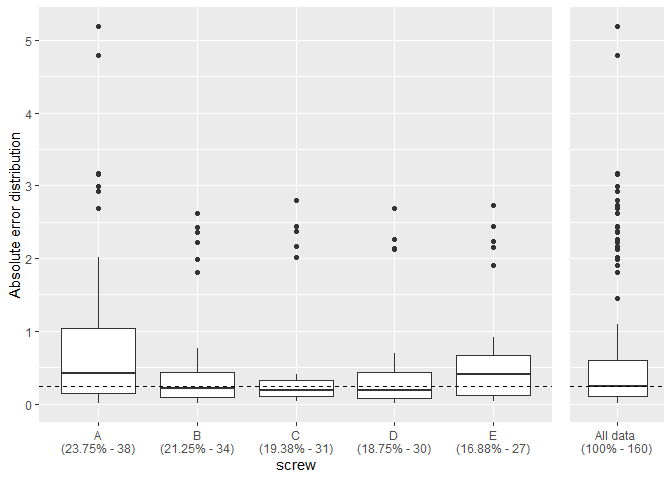
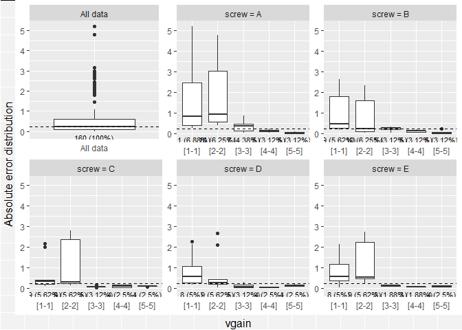
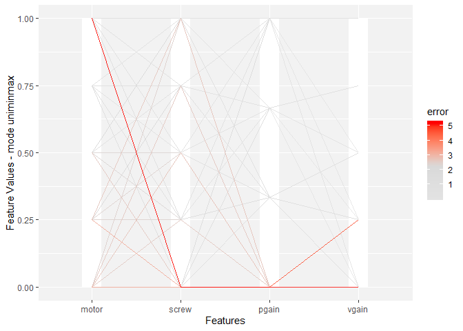
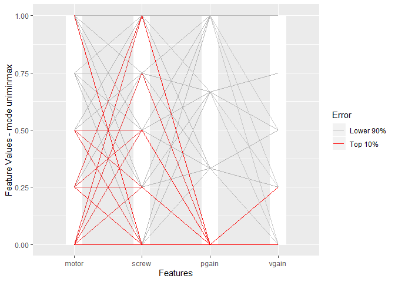
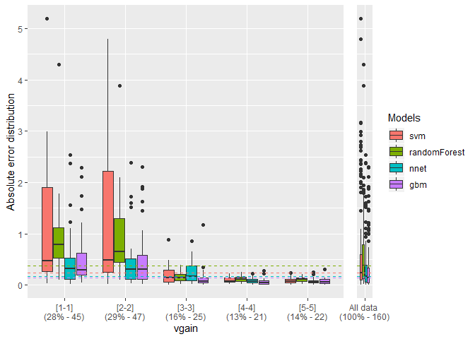
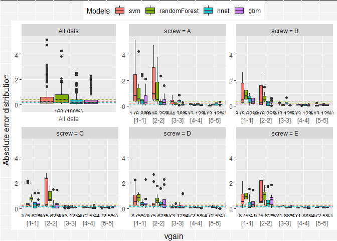

# MSc Thesis: **Visual Tools for Understanding Regression Black-Box Models**

## *Inês Areosa*

## *Supervisors: Luís Torgo and Luís Custódio*

This page contains the code, data and resulting plots of the experiments
in the MSc Thesis *Visual Tools for Understanding Regression Black-Box
Models* (November, 2019).

First, it is provided an explanation on how the full experiments can be
reproduced, followed with an example of the proposed tools.

Then, it is provided a zip file with the plots and code corresponding to
all 18 data sets, not included in the paper due to space limitation.

Lastly, the plots for the case study of the Fishing Effort are also made
available for all Large Scale Marine Protected Areas in study.

## Requirements

[R](www.r-project.org) is required for reproducing the experiments. The
following R extra packages, available on
[CRAN](https://cran.r-project.org/web/packages/), are also needed:

  - dplyr
  - GGally
  - plyr
  - gridExtra
  - reshape2

## Usage

Tested on R 3.5.2

The benchamark data sets can be downloaded [here](Datasets.zip). The
full code and resultant plots can be downloaded [here](https://drive.google.com/file/d/1JVXOkJ3uy1jD7qNx4G8I89eM0mPnOXOG/view?usp=sharing).
The full plots of the LSMPAs can be downloaded [here](https://drive.google.com/file/d/1omoqvDHgXNEe-iVimle4xXjfPR7oAbA-/view?usp=sharing)

### Load Functions and Dataset

``` r
## Loading functions required (as well as required packages)
source("Performance/performance_functions.R")

## Loading Dataset
load("Datasets/dataSetsWithPreds.Rdata")
names(DSsPreds) <- c('a1','a2','a3','a4','a6','a7','Abalone','acceleration','availPwr','bank8FM','cpuSm','fuelCons','boston','maxTorque','machineCpu','servo','airfoild','concreteStrength')
nmod <- 4
```

### Run the Experiments for the Full Benchmark Dataset

`Rscript DataSet_Performance.R`

### An Example on How to Employ the Single Model Functionalities

Choose what type of error the end user wants to analyse: “Absolute”,
Logarithmic (“Log”) or “Residual”

``` r
err <- "Absolute"
```

Choose a particular data set from the full benchmark

``` r
y_observed <- "servo"
dataset <- DSsPreds[[y_observed]][complete.cases(DSsPreds[[y_observed]]),]
#Show part of dataset
head(dataset, n=10)
```

    ##        class motor screw pgain vgain       svm randomForest      nnet
    ## 2  0.5062525     B     D     6     5 0.2900076    0.6149509 0.4978377
    ## 3  0.3562515     D     D     4     3 0.3578499    0.7451938 0.3744596
    ## 4  5.5000330     B     A     3     2 2.3349060    3.5569774 5.3794819
    ## 5  0.3562515     D     B     6     5 0.1132223    0.5061218 0.5189971
    ## 6  0.8062546     E     C     4     3 0.6389633    0.7591382 0.7645144
    ## 7  5.1000140     C     A     3     2 2.4161065    3.3112188 4.7620321
    ## 8  5.7000422     A     A     3     2 2.5394272    3.6095884 5.6397336
    ## 9  0.7687544     C     A     6     5 0.8673949    0.7002441 0.6786782
    ## 10 1.0312537     D     A     4     1 0.2768152    0.9303311 0.5163344
    ## 11 0.4687523     B     E     6     5 0.3456481    0.6151508 0.5313446
    ##          gbm
    ## 2  0.5082631
    ## 3  1.5328608
    ## 4  6.5008834
    ## 5  0.3285793
    ## 6  0.8242099
    ## 7  5.6361385
    ## 8  6.1413950
    ## 9  0.6652546
    ## 10 0.4583367
    ## 11 0.4178387

Choose which model is to be analysed and prepare the data

``` r
mod <- "svm"
single_error_ds <- single_model_data(data=dataset[1:(length(dataset) - nmod)], model=dataset[[mod]], feature_y=names(dataset)[1], type=err)
head(single_error_ds, n=10)
```

    ##    motor screw pgain vgain      pred       error
    ## 2      B     D     6     5 0.2900076 0.216244940
    ## 3      D     D     4     3 0.3578499 0.001598371
    ## 4      B     A     3     2 2.3349060 3.165127041
    ## 5      D     B     6     5 0.1132223 0.243029150
    ## 6      E     C     4     3 0.6389633 0.167291290
    ## 7      C     A     3     2 2.4161065 2.683907517
    ## 8      A     A     3     2 2.5394272 3.160615011
    ## 9      C     A     6     5 0.8673949 0.098640528
    ## 10     D     A     4     1 0.2768152 0.754438469
    ## 11     B     E     6     5 0.3456481 0.123104197

  - **EDP**

Choose a predictor and calculate the EDP. Here is the example with a
numeric (“vgain”) and a categorical (“screw”), as well as the bivariate
EDP for both features:

``` r
edp(single_error_ds, "vgain", type=err, jitter=FALSE)
edp(single_error_ds, "screw", type=err, jitter=FALSE)

# Bivariate EDP: Option "All" for the comparative facet to show the overall error distribution
plot(multiple_edp(single_error_ds, c("vgain", "screw"), type=err, option='All', ncols=3, mode="wrap"))
```

<!-- --><!-- -->

    ## Using freq as weighting variable

<!-- -->

  - **PEP**

Plot for all predictors:

``` r
pep(single_error_ds, type=err, option="A")
pep(single_error_ds, type=err, option="B")
```

<!-- --><!-- -->

### An Example on How to Employ the Multiple Model Functionality

``` r
multiple_error_ds <- all_model_data(data=dataset, model=c("svm", "randomForest", "nnet","gbm"), feature_y=names(dataset)[1], type=err)
head(multiple_error_ds, n=10)
```

    ##    motor screw pgain vgain   predsvm predrandomForest  prednnet   predgbm
    ## 2      B     D     6     5 0.2900076        0.6149509 0.4978377 0.5082631
    ## 3      D     D     4     3 0.3578499        0.7451938 0.3744596 1.5328608
    ## 4      B     A     3     2 2.3349060        3.5569774 5.3794819 6.5008834
    ## 5      D     B     6     5 0.1132223        0.5061218 0.5189971 0.3285793
    ## 6      E     C     4     3 0.6389633        0.7591382 0.7645144 0.8242099
    ## 7      C     A     3     2 2.4161065        3.3112188 4.7620321 5.6361385
    ## 8      A     A     3     2 2.5394272        3.6095884 5.6397336 6.1413950
    ## 9      C     A     6     5 0.8673949        0.7002441 0.6786782 0.6652546
    ## 10     D     A     4     1 0.2768152        0.9303311 0.5163344 0.4583367
    ## 11     B     E     6     5 0.3456481        0.6151508 0.5313446 0.4178387
    ##       errorsvm errorrandomForest   errornnet    errorgbm
    ## 2  0.216244940        0.10869838 0.008414849 0.002010616
    ## 3  0.001598371        0.38894232 0.018208169 1.176609302
    ## 4  3.165127041        1.94305557 0.120551073 1.000850380
    ## 5  0.243029150        0.14987033 0.162745574 0.027672165
    ## 6  0.167291290        0.04711635 0.041740195 0.017955335
    ## 7  2.683907517        1.78879520 0.337981938 0.536124461
    ## 8  3.160615011        2.09045381 0.060308582 0.441352795
    ## 9  0.098640528        0.06851030 0.090076135 0.103499805
    ## 10 0.754438469        0.10092259 0.514919279 0.572917032
    ## 11 0.123104197        0.14639851 0.062592322 0.050913557

  - **MEDP**

Choose a predictor and calculate the MEDP. Here is the example with
feature “vgain”, as well as the bivariate MEDP for the same feature:

```r
medp(multiple_error_ds, "vgain", mod_names=c("svm", "randomForest", "nnet","gbm"), type=err)

# Bivariate MEDP: Option 3 for the comparative facet to show the overall error distribution
plot(biv_medp(multiple_error_ds, c("vgain", "screw"), mod_names=c("svm", "randomForest", "nnet","gbm"), type=err, option=3))
```

<!-- --><!-- -->
